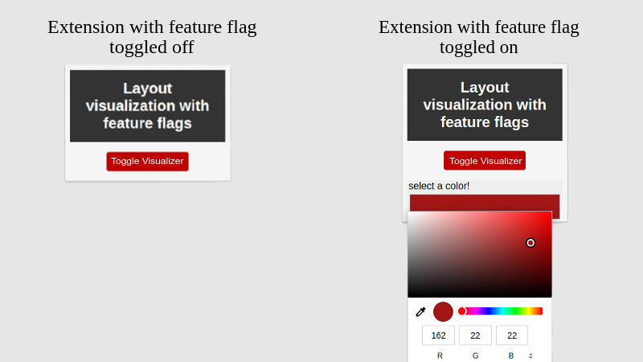

# Feature Flags in a Chrome Extension

## Layout Visualization Extension with Feature Flags

This repository contains a demo application demonstrating how to implement ConfigCat's feature flag services in a Chromium extension. The extension provides a visualization of a page layout and possible misalignment of individual HTML elements in the active browser tab.

The extension can behave in two ways based on the feature flag settings:

1. When the feature flag is toggled off, the extension outlines HTML elements on the currently open tab in red.
2. When the feature flag is toggled on, the extension allows the user to customize the outline color.



## Build & Run

1. Clone this repository to your local machine.
2. Open a terminal and navigate to the root directory of the sample app.
3. Open the main.js file and update the ConfigCat SDK key and the feature flag name to match those set in the [ConfigCat Dashboard](https://app.configcat.com/dashboard).

4. Install the dependencies with:

```shell
npm run dev
```

5. Build the app with:

```shell
npm run build
```

6. Open Google Chrome and navigate to `chrome://extensions/`
7. Enable developer mode
8. Load the extension from the build directory into the Chrome browser.

## Useful links:

SDK on [NPM](https://nodei.co/npm/configcat-js-chromium-extension/)

[**ConfigCat**](https://configcat.com) also supports many other frameworks and languages. Check out the full list of supported SDKs [here](https://configcat.com/docs/sdk-reference/overview/).

You can also explore other code samples for various languages, frameworks, and topics here in the [ConfigCat labs](https://github.com/configcat-labs) on GitHub.

Keep up with ConfigCat on [Twitter](https://twitter.com/configcat), [Facebook](https://www.facebook.com/configcat), [LinkedIn](https://www.linkedin.com/company/configcat/), and [GitHub](https://github.com/configcat).

## Author
[Emil Kovacevic](https://github.com/emilkovacevic)

## Contributions
Contributions are welcome!
